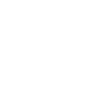

<div align="center">
  <!-- Brief -->
  <h2>Property Pulse</h2>
  <p >
  Find The Perfect Rental. Property Pulse is a website where you can find the perfect property that suits your needs.
  </p>

  

  <br>
  
  <!-- Screenshot -->
  <a align="center" href="https://property-pulse-hs.onrender.com">
    
  </a>

  <h3>
    <a href="https://property-pulse-hs.onrender.com">
      <strong>Demo Website</strong>
    </a>
  </h3>

  <div>
    <a href="https://property-pulse-hs.onrender.com">View Demo</a>
    &emsp;•&emsp;
    <a href="https://github.com/hebersolano/property-pulse/issues">Report Bug</a>
   &emsp;•&emsp;
    <a href="https://github.com/hebersolano/property-pulse/pulls">Request Feature</a>
  </div>

  <br>
  
  

  <hr>

</div>

## Table of contents

- [Build process and details: ](BUILD-PROCESS.md)
- [Installation](#installation)
- [Author](#author)
- [Acknowledgments](#acknowledgments)

### Installation

- Clone this repo:

```sh
git clone https://github.com/hebersolano/property-pulse.git
```

- Install dependencies:

```sh
npm install
```

- Create a dev.local file with this variables:

```env
MONGODB_URI=""

NEXT_PUBLIC_DOMAIN="http://localhost:3000"
NEXT_PUBLIC_API="http://localhost:3000/api"

NEXTAUTH_URL="http://localhost:3000"
NEXTAUTH_URL_INTERNAL="http://localhost:3000"
NEXTAUTH_SECRET=""

GOOGLE_CLIENT_ID=""
GOOGLE_CLIENT_SECRET=""

CLOUDINARY_CLOUD_NAME = ""
CLOUDINARY_KEY=""
CLOUDINARY_SECRET=""

NEXT_PUBLIC_MAPBOX_TOKEN=""
```

- Build command:

```sh
npm run build
```

- Live server:

```sh
npm run dev
```

### Author

<b>👤 Heber Solano</b>

<!-- Badges -->
<div>
<ul style="list-style: none; display: flex; flex-direction: column; gap: 0.5rem">
  <li>
    <a href='https://github.com/hebersolano/' target="_blank"></a>
  </li>
  <li>
    <a href='https://www.linkedin.com/in/heber-solano/' target="_blank"></a>
  </li>
</div>

Feel free to contact me with any questions or feedback!

### Acknowledgments

This app was developed as part of the [Next.js From Scratch 2024](https://www.udemy.com/course/nextjs-from-scratch/) course by [Brad Traversy](https://www.traversymedia.com/). Special thanks to Brad for his exceptional teaching and guidance during the course.
